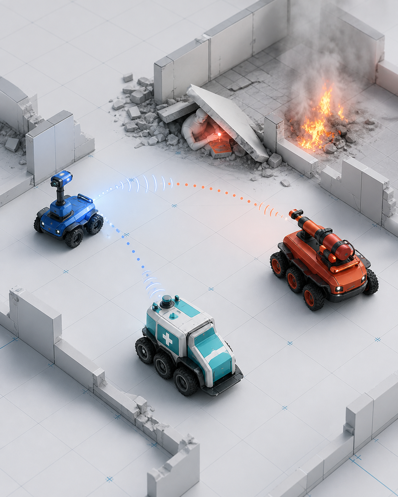

# RELAY



RELAY is a deterministic heterogeneous multi-agent reinforcement-learning
environment for studying learned communication in cooperative search and rescue.
A Scout, Ambulance agents, and Fireman agents explore a partially observed grid,
communicate continuous learned messages, and resolve role-specific incidents.

The repository includes the PettingZoo environment, frozen scenario splits,
recurrent MAPPO training, CUDA support, checkpoint/resume, evaluation, structured
logging, verifiable Parquet replays, a desktop replay viewer, and media export.

> The detailed behavior and architecture reference is [AUDIT.md](AUDIT.md).

## Important task semantics

- Scout: sees farther (radius 4), moves up to 2 cells, cannot resolve incidents.
- Ambulance: sees radius 2, moves 1 cell, resolves victims in place.
- Fireman: sees radius 2, moves 1 cell, resolves fires in place.
- There is no victim pickup or hospital/drop-off step. The central staging area is
  not a rescue destination.
- Agents may share cells; there are no collision dynamics.
- Every agent receives the same team reward.
- Messages are learned eight-float vectors. Communication range is global.

## Requirements

- Windows PowerShell
- CPython 3.11.9 (installed and selected by `uv`)
- `uv`
- NVIDIA driver and CUDA-capable GPU for GPU training
- Several GB of free disk space for dependencies and experiment logs

The lockfile selects the official PyTorch CUDA 13.0 build on Windows. CUDA Toolkit
13.3 is currently detected on the development machine.

## First-time setup

From the project root:

```powershell
Set-Location V:\Projects\Relay
uv python install 3.11.9
uv sync --all-extras
& .\Activate-Relay.ps1
python ci\run_release_checks.py --skip-manifests
```

The first sync downloads the large CUDA PyTorch package and can take time.

## Every new PowerShell window

Activate once:

```powershell
Set-Location V:\Projects\Relay
& .\Activate-Relay.ps1
```

Then use `relay-train`, `relay-evaluate`, `relay-replay`, and `relay-scenarios`
directly. You do not need to type `.venv\Scripts` before every command.

To leave the environment:

```powershell
deactivate
```

## Verify CUDA

```powershell
python -c "import torch; print(torch.__version__); print(torch.cuda.is_available()); print(torch.cuda.get_device_name(0) if torch.cuda.is_available() else 'NO CUDA')"
nvcc --version
nvidia-smi
```

Expected on the configured machine:

```text
2.13.0+cu130
True
NVIDIA GeForce RTX 5070 Laptop GPU
```

When training starts, verify the banner contains:

```text
device=cuda (NVIDIA GeForce RTX 5070 Laptop GPU)
```

The PettingZoo/NumPy environment workers still run on CPU, so CPU usage is normal.
The model, inference tensors, loss, backpropagation, and optimizer run on CUDA.

## Quick smoke training

This is a short functional test, not a scientific result:

```powershell
relay-train `
  --config configs\experiments\smoke_train.yaml `
  execution.device=cuda
```

Training prints completed/total steps, percentage, PPO update, throughput, ETA,
reward, losses, episode statistics, and every saved checkpoint.

## Inspect a config before running

Configurations compose `configs/base.yaml`, a preset, and an experiment file.
CLI overrides use typed `section.field=value` syntax.

```powershell
relay-train `
  --config configs\experiments\v1_nocomm.yaml `
  --dry-run `
  execution.num_workers=4 `
  execution.envs_per_worker=2 `
  execution.device=cuda
```

The dry run prints the complete resolved YAML, override diff, and checksum without
creating a run. Unknown keys and invalid values fail. Scientific comparison fields
such as grid, team, and communication mode are locked.

## Random NoComm versus AlwaysComm baseline

Generate one paired random episode for each condition and open both viewers:

```powershell
relay-replay baseline --episodes 1 --no-export --view
```

Generate 100 numerical baseline episodes without media encoding:

```powershell
relay-replay baseline --episodes 100 --no-export
```

Generate one pair and export compact GIF previews:

```powershell
relay-replay baseline --episodes 1
```

`--no-export` means “save the runs and Parquet replays, but do not encode GIF/MP4
media.” It does not disable logging. `--view` opens interactive replay windows.

The paired baseline uses identical scenario seeds and random physical actions in
both communication conditions and verifies that physical trajectory checksums
match.

## Start scientific training

Recommended initial worker layout for the current laptop is four worker processes
with two environments each. Run experiments sequentially unless GPU memory and
throughput measurements justify parallel training.

### V1 NoComm

```powershell
relay-train `
  --config configs\experiments\v1_nocomm.yaml `
  execution.num_workers=4 `
  execution.envs_per_worker=2 `
  execution.device=cuda
```

### V1 AlwaysComm

```powershell
relay-train `
  --config configs\experiments\v1_always_comm.yaml `
  execution.num_workers=4 `
  execution.envs_per_worker=2 `
  execution.device=cuda
```

The standard target is 2,000,000 environment timesteps. A full update collects
`rollout_steps * total_vector_envs` timesteps, so the final count can slightly
exceed the target.

Other experiment configs:

| File | Condition |
|---|---|
| `p1_always.yaml` | Always broadcast with communication cost |
| `p1_when.yaml` | Learn whether to broadcast |
| `p2_who_only.yaml` | Always send, but learn the recipient |
| `p2_full.yaml` | Learn whether and to whom to send |
| `p3_context.yaml` | Five-agent contextual communication |
| `o1_latency.yaml` | WHEN+WHO with two extra latency steps |
| `o1_loss.yaml` | WHEN+WHO with 10% packet loss |

## Monitor training

The terminal progress line is the immediate status. TensorBoard provides historical
curves:

```powershell
tensorboard --logdir runs
```

Open the printed local URL in a browser. Useful series are under `train/`, including
reward, policy/value loss, entropy, approximate KL, clip fraction, gradient norm,
episode return, and episode length.

Training currently does not perform periodic validation or select a “best” model.
Evaluate interval checkpoints explicitly when needed.

To watch GPU activity in another PowerShell window:

```powershell
nvidia-smi -l 1
```

## Run directories and checkpoints

Every launch creates a unique directory:

```text
runs\YYYYMMDDTHHMMSSZ-<experiment>-<config-hash>\
```

If a collision occurs, a numeric suffix is added; runs are never silently
overwritten. Important files:

```text
manifest.json
resolved_config.yaml
config_diff.json
checkpoints\latest.pt
checkpoints\step_XXXXXXXXX.pt
metrics\tensorboard\
events\
replays\
errors\failure.json
```

`manifest.json` says whether a run is `running`, `complete`, or `failed`. A process
killed forcefully can leave the status as `running`; inspect its checkpoint folder
before resuming.

Detailed timestep event logs are large. The completed 2-million-step reference run
in this workspace generated hundreds of megabytes.

## Resume training

Use the same experiment config and the same total number of vector environments as
the original launch:

```powershell
relay-train `
  --config configs\experiments\v1_nocomm.yaml `
  --resume runs\<training-run-id>\checkpoints\latest.pt `
  execution.num_workers=4 `
  execution.envs_per_worker=2 `
  execution.device=cuda
```

To extend a completed run, raise the total target:

```powershell
relay-train `
  --config configs\experiments\v1_nocomm.yaml `
  --resume runs\<training-run-id>\checkpoints\latest.pt `
  training.total_timesteps=3000000 `
  execution.num_workers=4 `
  execution.envs_per_worker=2 `
  execution.device=cuda
```

Resume restores the model, optimizer, recurrent state, environment states, episode
cursors, and Python/NumPy/PyTorch/CUDA RNG states. It resumes the original run
directory rather than making a new training run.

## Evaluate a checkpoint

Use the experiment config that trained the checkpoint:

```powershell
relay-evaluate `
  --config configs\experiments\v1_nocomm.yaml `
  --checkpoint runs\<training-run-id>\checkpoints\latest.pt `
  execution.device=cuda `
  evaluation.episodes=100
```

Evaluation defaults to deterministic policy actions and ordered seeds from the
frozen test split. It creates a separate run and saves:

- per-episode return, length, success, seed, and replay path;
- aggregate success rate, mean return, and mean length;
- one complete Parquet replay per episode;
- structured evaluation events and provenance.

Use `evaluation.start_index=N` to evaluate a different non-overlapping slice. The
requested range must fit inside the 1,000-seed split.

## Replay commands

Set a path once for easier reuse:

```powershell
$replay = "runs\<evaluation-run-id>\replays\episode_000000.parquet"
```

Summarize metadata:

```powershell
relay-replay summary $replay
```

Deterministically rerun all stored actions and verify every state hash:

```powershell
relay-replay verify $replay
```

Open the desktop viewer:

```powershell
relay-replay view $replay
```

Export media:

```powershell
relay-replay export $replay --output output\episode.gif --fps 8 --stride 2
relay-replay export $replay --output output\episode.mp4 --fps 8 --stride 2
relay-replay export $replay --output output\episode.png --start 40
```

The viewer is replay-only: it reads stored snapshots and never steps or mutates the
simulation. `relay-replay generate` is the operation that runs a checkpoint to make
a new replay:

```powershell
relay-replay generate `
  --config configs\experiments\v1_nocomm.yaml `
  --checkpoint runs\<training-run-id>\checkpoints\latest.pt `
  --episodes 1 `
  execution.device=cuda
```

## Scenario manifests and calibration

The committed manifests are frozen scientific artifacts. Do not regenerate them
unless the environment/generator version is intentionally changed.

Validate the pilot manifest:

```powershell
relay-scenarios validate configs\manifests\relay-grid-v1.json --workers 4
```

Validate the P3 manifest:

```powershell
relay-scenarios validate configs\manifests\relay-grid-v1-p3.json --workers 4
```

Create random and privileged-oracle calibration data:

```powershell
relay-scenarios calibrate `
  configs\manifests\relay-grid-v1.json `
  --split validation `
  --episodes 100 `
  --output output\calibration\relay-grid-v1.parquet
```

The oracle is a privileged feasibility upper bound. It is not used for training or
reported as decentralized learned performance.

## Direct environment API

```python
import numpy as np

from relay import RelayParallelEnv

env = RelayParallelEnv(preset="pilot_core", communication_mode="when_who")
observations, infos = env.reset(seed=7)

while env.agents:
    actions = {
        agent: {
            "physical": 0,
            "send": 0,
            "recipient": 0,
            "message": np.zeros(8, dtype=np.float32),
        }
        for agent in env.agents
    }
    observations, rewards, terminations, truncations, infos = env.step(actions)

env.close()
```

The action and observation schemas, reward formula, communication timing, and
network layers are documented in [AUDIT.md](AUDIT.md).

## Testing

Quick release gate:

```powershell
python ci\run_release_checks.py --skip-manifests
```

Full release gate, including all 20,000 frozen pilot/P3 scenarios:

```powershell
python ci\run_release_checks.py
```

Individual tools:

```powershell
python -m pytest -q
python -m ruff check src tests ci
python -m mypy src
```

## Generated files and Git

Training runs, checkpoints, TensorBoard data, Parquet logs/replays, media exports,
virtual environments, caches, and temporary files are ignored by `.gitignore`.
Commit source, configs, frozen manifests, tests, and documentation. Do not force-add
checkpoints or generated run data.

## Troubleshooting

### `No Python at C:\Users\...\uv\python...`

Use the project helper, which repairs the venv runtime reference:

```powershell
& .\Activate-Relay.ps1
```

### Training banner says `device=cpu`

The checked-in base config defaults to CPU for portability. Include:

```text
execution.device=cuda
```

Confirm the resolved YAML printed before training says `device: cuda`.

### CPU usage is high during CUDA training

Expected. Map generation, environment stepping, IPC, and event serialization run
on CPU. Confirm the training banner says CUDA and use `nvidia-smi -l 1` to observe
GPU allocations/activity.

### A command appears idle

Training may initially say `collecting first rollout...`; it reports after the
first rollout/PPO update. Baseline and evaluation commands print episode/tick
progress. GIF/MP4 export is CPU-side encoding and can take longer than simulation.

### Disk usage grows quickly

Training logs every transition to compressed Parquet in addition to TensorBoard
and checkpoints. Archive or remove old generated run directories after preserving
the results you need. They are Git-ignored by default.
